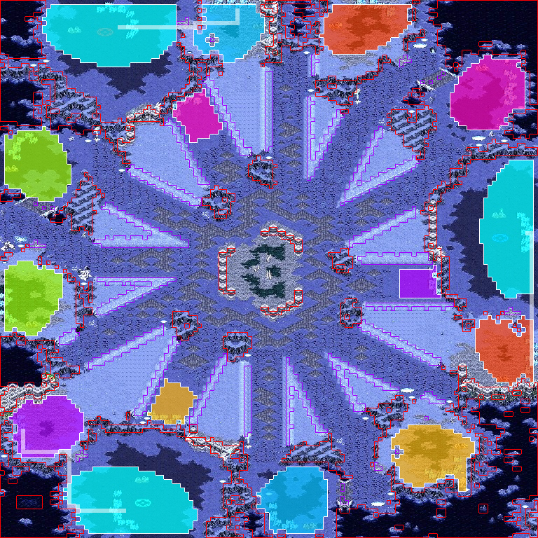

# scmapanalyzer

- ⚠️ WARNING: this is a work in progress! Still working in the algorithm, and API is not stable yet.
- `scmapanalyzer` is a Go library that parses StarCraft: Brood War replays and provides:
    - All "base" approximate polygons.
    - Distinction between: "starting locations", "natural expansions" and "expansions".
    - Naming convention for bases, using o'clock notation.
- It also ships with developer tools to debug and evolve the internal algorithms.

## Example debug overlay to visualize what it provides



## Why is this useful?

- This is a library meant to be imported by replay analyzers.
- It allows analyzers to put replay commands' coordinates in the context of the map geometry, example:
    - Building a Hatchery is not the same as _"expanding" to a natural expansion_.
    - Building a Cannon _in your natural_ in a ZvP at a certain timing means defending from a Hydra timing.
    - Building a Bunker _in close proximity to your enemy's natural_ at a certain timing in a TvZ is a Bunker Rush.
    - ... you see the idea. You can also track who "owns" each base in linear time as you parse the replay.

## What you get

The API returns [`replaymap.Result`](replaymap/types.go): JSON-serializable fields match the shape below.

```go
type Result struct {
    ReplayPath string         `json:"replay_path"`
    MapName    string         `json:"map_name"`
    TileSetKey string         `json:"tileset_key"`
    Starts     []BasePolygon  `json:"starting_locations"`
    Expas      []BasePolygon  `json:"expansions"`
}

type BasePolygon struct {
    Name             string      `json:"name"`
    Kind             string      `json:"kind"`              // "start" or "expa"
    Clock            int         `json:"clock"`             // minimap clock hour (1,3,5,…)
    CenterTile       TilePoint   `json:"center_tile"`
    PolygonVertices  []TilePoint `json:"polygon_vertices"`
    NaturalExpansion string      `json:"natural_expansion,omitempty"` // expa name for starts
}

type TilePoint struct {
    X int `json:"x"`
    Y int `json:"y"`
}
```

## Usage

```go
import (
    "log"

    "github.com/marianogappa/scmapanalyzer/lib/scmapanalyzer"
)

func run() {
    client, err := scmapanalyzer.NewClient()
    if err != nil {
        log.Fatal(err)
    }

    // Important! If you pass the map name, and the map exists in the pre-warmed cache, the replay is not parsed.
    // This makes the method return immediately.
    res, err := client.Analyze("/path/to/game.rep", scmapanalyzer.WithMapName("Fighting Spirit"))
    if err != nil {
        log.Fatal(err)
    }

    _ = res.Starts
    _ = res.Expas
    _ = res.TileSetKey
}
```

Import path: `github.com/marianogappa/scmapanalyzer/lib/scmapanalyzer`.

## Developer tools

- **`cmd/replaymapanalyzer`** — CLI: read one replay, write JSON and optional PNG overlay (needs `-map-image` from [`map-images/`](map-images/) for the overlay).
- **`cmd/tiletagger`** — build or extend wall/ramp tile ID lists from a minimap plus [`sample-map-masks/`](sample-map-masks/) (red wall / purple ramp) and a replay search path; writes per-tileset JSON like those under `lib/scmapanalyzer/cache/tilesets/`.

```bash
go run ./cmd/replaymapanalyzer \
  -replay replays/30-lIlIIIIIIllllll/MM-268BF7A8-FC4B-11F0-A3DD-FA167B5461B6.rep \
  -tags-repo output/tagged-tilesets \
  -map-image map-images/dominator_se.jpg \
  -out-json output/replaymap-analyzer.json \
  -out-image output/replaymap-analyzer-overlay.png
```

License: [MIT](LICENSE).

## Credits

This project would have been impossible without the invaluable work of [@icza](https://github.com/icza) on [screp](https://github.com/icza/screp), a Go library for parsing StarCraft: Brood War replays, and his online help.